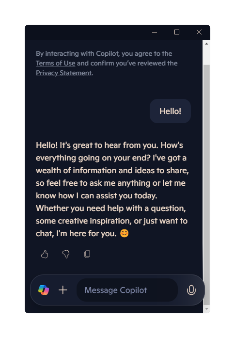

<p align="center">
	
	<h1 align="center">Bing Chat</h1>
	<p align="center">Desktop application of new Bing's AI-powered chat</p>
</p>

<p align="center">
	<a href="https://opensource.org/licenses/Apache-2.0"></a>
	<a href="https://github.com/foxypiratecove37350/BingChat/releases">
		
	</a>
</p>

## Install

### Windows

- [BingChat-0.3.8-win32-x64-Setup.exe](https://github.com/foxypiratecove37350/BingChat/releases/download/v0.3.8/BingChat-0.3.8-win32-x64-Setup.exe) (Installer)
- [BingChat-0.3.8-win32-x64.zip](https://github.com/foxypiratecove37350/BingChat/releases/download/v0.3.8/BingChat-0.3.8-win32-x64.zip) (Portable)
- [BingChat-0.3.8-win32-arm64-Setup.exe](https://github.com/foxypiratecove37350/BingChat/releases/download/v0.3.8/BingChat-0.3.8-win32-arm64-Setup.exe) (Installer)
- [BingChat-0.3.8-win32-arm64.zip](https://github.com/foxypiratecove37350/BingChat/releases/download/v0.3.8/BingChat-0.3.8-win32-arm64.zip) (Portable)

### macOS

- [BingChat-0.3.8-darwin-arm64.dmg](https://github.com/foxypiratecove37350/BingChat/releases/download/v0.3.8/BingChat-0.3.8-darwin-arm64.dmg) (Apple Silicon)
- [BingChat-0.3.8-darwin-x64.dmg](https://github.com/foxypiratecove37350/BingChat/releases/download/v0.3.8/BingChat-0.3.8-darwin-x64.dmg) (Intel chips)

### Linux

- [BingChat-0.3.8-linux-x64.deb](https://github.com/foxypiratecove37350/BingChat/releases/download/v0.3.8/BingChat-0.3.8-linux-x64.deb)
- [BingChat-0.3.8-linux-arm64.deb](https://github.com/foxypiratecove37350/BingChat/releases/download/v0.3.8/BingChat-0.3.8-linux-arm64.deb)
- [BingChat-0.3.8-linux-x64.rpm](https://github.com/foxypiratecove37350/BingChat/releases/download/v0.3.8/BingChat-0.3.8-linux-x64.rpm)
- [BingChat-0.3.8-linux-arm64.rpm](https://github.com/foxypiratecove37350/BingChat/releases/download/v0.3.8/BingChat-0.3.8-linux-arm64.rpm)

## Usage

- Sign in to your Microsoft account (optional)
- Start chatting

> [!NOTE]
> VPN is required if Microsoft Edge Copilot is not available in your area. Make sure `bing.com`, its subdomains, `microsoft.com` and its subdomains are included in proxy rules.

**If the app cannot be opened in macOS, execute the following command in Terminal app:**

```
sudo xattr -d com.apple.quarantine /Applications/BingChat.app
```

## Features

- Chat with Microsoft Edge Copilot in its own window
- Export full conversation to Markdown, PNG or PDF
  > [!NOTE]
  > Text is shifted down for PNG and PDF export, see [html2canvas/issues#2775](https://github.com/niklasvh/html2canvas/issues/2775)
- Customize appearance (theme & font size)
- Keyboard shortcuts
- Multi-platform

## Shortcuts

| Action            | Shortcut                                        |
| ----------------- | ----------------------------------------------- |
| New topic         | <kbd>Ctrl/Cmd</kbd> + <kbd>N</kbd>              |
| Focus on textarea | <kbd>Ctrl/Cmd</kbd> + <kbd>I</kbd>              |
| Always on top     | <kbd>Ctrl/Cmd</kbd> + <kbd>T</kbd>              |
| Reload            | <kbd>Ctrl/Cmd</kbd> + <kbd>R</kbd>              |
| Set font size     | <kbd>Ctrl/Cmd</kbd> + <kbd>+</kbd>/<kbd>-</kbd> |

<kbd>Ctrl</kbd> - Windows and Linux

<kbd>Cmd</kbd> (<kbd>⌘</kbd>) - macOS

## Screenshot



## License

Bing Chat is licensed under the [Apache-2.0 License](https://www.apache.org/licenses/LICENSE-2.0.html), see [`LICENSE`](./LICENSE) for more information.
